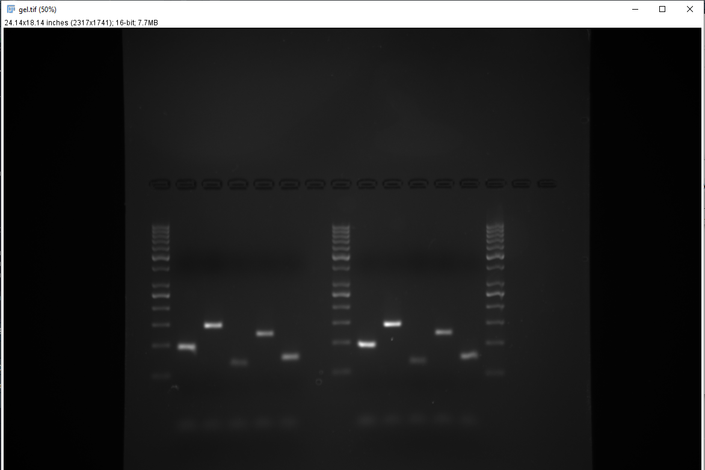
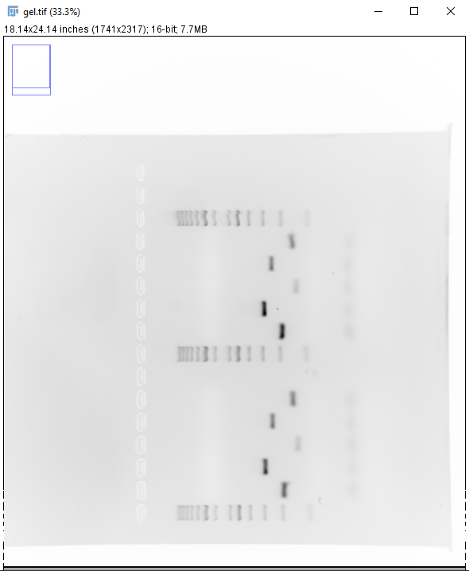
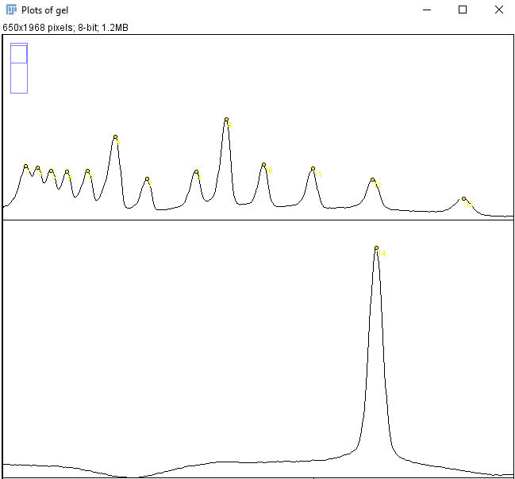
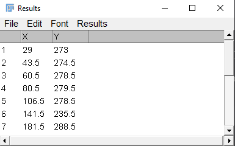

# Background 

The product size from PCR reactions is determined by primer design and subsequent specificity. A specific primer will produce a product length corresponding to the length of the segment amplified by the primers. If primers are unspecific, covering multiple templates, product lengths will potentially vary. PCR-product size can therefore be used to determine if a PCR reaction has targeted the expected template.

This tutorial will show how to determine sizes of PCR products from an agarose gel using ImageJ and R.

# Prerequisite

Download [ImageJ Fiji](https://imagej.net/Fiji). Examples of data analyses below are performed in [R](https://cran.r-project.org/) and [RStudio](http://www.rstudio.com).

A general protocol for agarose gel electrophoresis can be found under protocols. 

# Measuring product migration distance in ImageJ

- Start ImageJ, open up a gel image (Figure 1).

<br>
- Invert the image (Shift + Ctrl + I) and rotate it (Image > Transform > Rotate) so that the top of the gel (wells) are on the left (Figure 2).

<br>
- Select the Rectangle tool in ImageJ and draw a box covering the wells of interest and the ladder, press Shift + X to crop the image (Figure 3). Make sure the wells runs horizontally, adjust the rotation otherwise.

<br>
- Using the Rectangle tool, select the well containing the ladder and press Ctrl + 1, move the Rectangle to the next well and press Ctrl + 2. Select all wells of interest using Ctrl + 2 except for the last well, select the last well using Ctrl + 3. A new window will appear (Figure 4).

<br>
- The curves in the new window represents the pixel intensity of each well. Go to the Analyze > Set Measurements in ImageJ and de-select all measurement, a single decimal places is sufficient. Select the Multi-point tool and mark every peak in each well (Figure 5).

<br>
When all peaks are marked press Ctrl + M. A new window should appear with x and y measurements (Figure 6).

<br>

# Calculate unknown product sizes based ladder estimates

- Create a spreadsheet with the data collected in ImageJ, alternatively, input your data in R directly (as below). The x-values from ImageJ are the values of interest.
- Input the data detailing the ladder (`mw` in the example below). We get this information from the description of the ladder. The GeneRuler 50 bp DNA Ladder (Thermo scientific) is used in this example.  

```{r, eval = TRUE}
# Create a data frame of known distances and molecular weights
ladder <- data.frame(dist = c(29, 43.5, 60.5,
                              80.5,	106.5,	141.5,	
                              181.5,	243.5,	281.5,
                              328.5,	390.5, 	465.5,	580.5), 
                     mw = c(1000, 900, 800, 
                            700, 600, 500,
                            400, 300, 250, 
                            200, 150, 100, 50))
            

# Create a new data frame of unknowns
unknown <- data.frame(dist = c(470.5,	391.5,	528.5,
                               421.5,	507.5))


```

- DNA fragment sizes will be linear to migration distance when expressed on the log scale. Create a "calibration model" using the ladder.

```{r, echo = FALSE, message=FALSE, warning=FALSE, fig.align='center', fig.height=5, fig.width=6}
library(tidyverse)

ladder %>%
        ggplot(aes(dist, log(mw))) + geom_point() + geom_smooth(method = "lm", se = FALSE)

```

```{r}
# Fit the model
cal <- lm(log(mw) ~ dist, data = ladder)

# Check model performance, R^2 should be ~ 1.
summary(cal)
```

- Estimate molecular weights from migration distances using the data frame of unknowns and the predict function. Since the model is created from log transformed data we need to convert to linear scale before interpreting using `exp()`. 

```{r}
preds <- exp(predict(cal, newdata = unknown) )
```

- Compare the measured sizes with predicted sizes from the primer design stage. 


